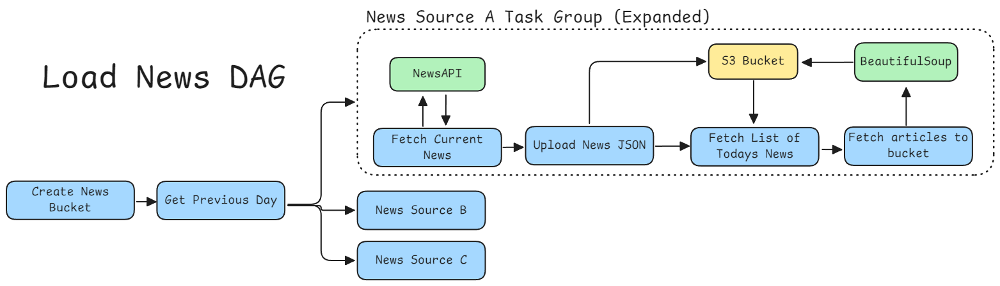
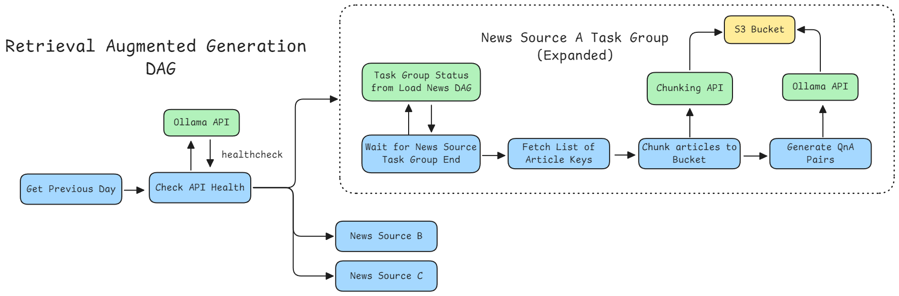

# News MLOps Pipeline and Interactive Dashboard and Chatbot

**A full-stack MLOps proof-of-concept** combining data engineering, machine learning, analytics, and conversational AI:
- **Daily news scraping** using `newsapi`, powered by `requests` + `BeautifulSoup`
- **Content analysis** via a Streamlit dashboard
- **Automated embedding model retraining** for Retrieval-Augmented Generation (RAG)
- **Interactive chatbot** to ask questions and retrieve information (powered by embeddings and RAG)

## DAG




## Features

-  Robust news ingestion from the web with HTML parsing  
-  End-to-end scheduling and orchestration via Apache Airflow (Scraping → ML → Analytics → Chatbot)  
-  Streamlit dashboard for real-time insights and monitoring  
-  Chatbot interface that answers user queries using the retrained embeddings  
-  Modular deployment using Docker Compose (PostgreSQL, MinIO, Redis, Airflow)


## Setup

1. Setup Project using Docker
    ```bash
    docker network create postgresql-network
    docker network create redis-network
    docker network create minio-network
    docker network create ollama-network
    docker network create embedding-preprocessor-api

    sudo docker compose \
        -f docker-compose-psql.yaml \
        --env-file .psql.env \
        -f docker-compose-minio.yaml \
        --env-file .minio.env \
        -f docker-compose-bare.yaml \
        --env-file .airflow.env \
        -f docker-compose-redis.yaml \
        -f docker-compose-embedding.yaml \
        -f docker-compose-ollama.yaml \
        up -d --build
    ```

## Web UIs

**Airflow**: http://localhost:8080
**MinIO Bucket**: http://localhost:9001

## Environment Variables

### Minio (S3)

```.env
MINIO_ROOT_USER=<user>
MINIO_ROOT_PASSWORD=<password>
MINIO_ADDRESS=":9000"
MINIO_STORAGE_USE_HTTPS=False
MINIO_CONSOLE_ADDRESS=":9001"
MINIO_PORT=9000
MINIO_CONSOLE_PORT=9001
```

### Postgresql

```.env
PG_USER=<psql_user>
PG_PASSWORD=<psql_password>
PG_DATABASE=airflow
PG_PORT=5432
```

### Airflow

```.env
AIRFLOW__CORE__EXECUTOR=CeleryExecutor
AIRFLOW__CORE__AUTH_MANAGER=airflow.providers.fab.auth_manager.fab_auth_manager.FabAuthManager
AIRFLOW__DATABASE__SQL_ALCHEMY_CONN=postgresql+psycopg2://<psql_user>:<psql_password>@postgresql-omegaserver:5432/airflow
AIRFLOW__CELERY__RESULT_BACKEND=db+postgresql://<psql_user>:<psql_password>@postgresql-omegaserver:5432/airflow
AIRFLOW__CELERY__BROKER_URL=redis://redis:6379/0
AIRFLOW_PORT=8080
AIRFLOW_PROJ_DIR=./airflow
AIRFLOW_UID=1000
AIRFLOW_CONN_MINIO_S3='{
    "conn_type": "aws", 
    "host": "minio", 
    "login": "<minio_username>", 
    "password": "<minio_password>", 
    "schema": "http", 
    "port": 9000, 
    "extra": {
        "region_name": "",
        "endpoint_url": "http://minio:9000"
    }
}'
AIRFLOW_VAR_NEWSAPI_API_KEY=<NEWSAPI_API_KEY>
AIRFLOW__API_AUTH__JWT_SECRET=
AIRFLOW_VAR_OLLAMA_MODEL='deepseek-r1:8b'
AIRFLOW_VAR_OLLAMA_ENDPOINT=http://ollama:11434
AIRFLOW_CONN_OLLAMA_API=http://ollama:11434
AIRFLOW_VAR_ENVIRONMENT=demo
```
- the `postgresql-omegaserver` is container name from `docker-compose-psql.yaml`
- generate `JWT_SECRET` using `openssl rand -base64 16`. (this is a fix for a problem i am experiencing in my home server where airflow worker is failing)
- replace AIRFLOW_VAR_OLLAMA_ENDPOINT with the endpoint if you are planning to run this in separate servers / devices. (In my case, the ollama endpoint is running in my pc)